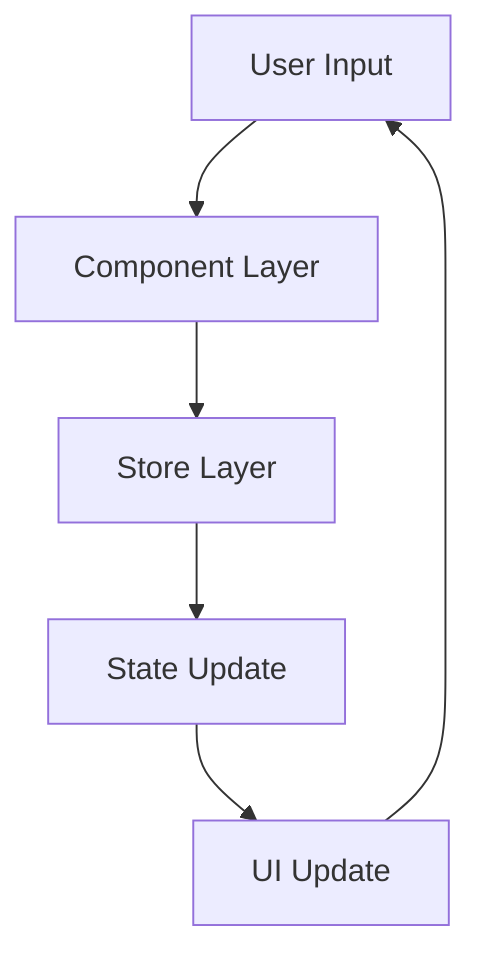

# Project Working Documentation

## Overview
This project is a React-based application that provides code editing capabilities with various features like syntax highlighting, keyboard shortcuts, and state management.

## Application Flow

### 1. Application Initialization
- Application starts from `main.tsx`
- React is initialized with the root App component
- Global styles from `index.css` are applied
- Store initialization occurs

### 2. Core Components

#### App Component (`App.tsx`)
- Serves as the main container
- Handles routing
- Manages global layout
- Integrates with store management
- Applies styles from `App.css`

#### CodeBlock Component (`CodeBlock.tsx`)
**Features:**
- Code editing functionality
- Syntax highlighting
- Real-time code updates
- Error handling
- Integration with store management

**Usage:**
```tsx
<CodeBlock
  code={sourceCode}
  language="javascript"
  onChange={handleCodeChange}
/>
```

#### Shortcuts Page (`Shortcuts.tsx`)
- Displays available keyboard shortcuts
- Provides user documentation
- Handles keyboard interactions

### 3. State Management

#### Settings Store (`settingsStore.ts`)
**Manages:**
- User preferences
- Application settings
- Theme configuration
- Editor preferences

**Key Operations:**
- Load/Save settings
- Update preferences
- Theme switching

#### Flow Store (`flowStore.ts`)
**Handles:**
- Application flow state
- Data flow management
- State transitions
- Event handling

### 4. Type System (`node.ts`)
**Provides:**
- Type definitions
- Interfaces
- Common type utilities
- Type safety across the application

### 5. Styling Structure
- `index.css`: Global styles, resets, variables
- `App.css`: Component-specific styles, layouts

## User Interaction Flow

1. **Initial Load**
   - Application boots
   - Stores initialize
   - Default settings loaded
   - UI renders

2. **Code Editing**
   - User opens code editor
   - CodeBlock component activates
   - Real-time syntax highlighting
   - Changes reflect in store

3. **Settings Management**
   - User modifies settings
   - Settings store updates
   - UI reflects changes
   - Settings persist

4. **Keyboard Shortcuts**
   - Available through Shortcuts page
   - Global shortcuts active
   - Component-specific shortcuts

## Data Flow



## Error Handling
1. **Component Level**
   - Try-catch blocks
   - Error boundaries
   - User feedback

2. **Store Level**
   - State validation
   - Error state management
   - Recovery mechanisms

## Performance Considerations
- React optimization techniques
- Store subscription management
- Efficient rendering
- Code splitting

## Best Practices
1. **Code Organization**
   - Component-based architecture
   - Clear file structure
   - Modular design

2. **State Management**
   - Centralized stores
   - Predictable state updates
   - Type safety

3. **Styling**
   - Consistent naming
   - Modular CSS
   - Theme support

## Development Workflow
1. Make changes in components
2. Update relevant stores
3. Test functionality
4. Update documentation
5. Deploy changes

## Future Improvements
- Enhanced error handling
- Additional keyboard shortcuts
- Performance optimizations
- Extended documentation
- More customization options


---

